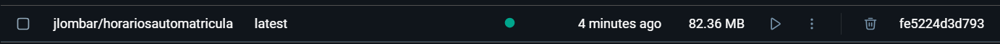

# Imagen para el contenedor
La imagen deberá cumplir los siguientes requisitos:
* Mantenimiento: debe tener un buen mantenimiento en activo para reducir la deuda técnica en el futuro
* En última instancia se valorará que la imagen pese poco, optimizando recursos al necesitar menos memoria.
## Algunas opciones
Debemos elegir una imagen de Docker para nuestro proyecto, para ello revisaremos las siguientes imágenes, teniendo en mente los requisitos que hemos listado:

### Alpine Linux
La imagen de [Alpine Linux](https://hub.docker.com/_/alpine) tiene un mantenimiento en activo, siendo su última versión hace sólo 3 meses. Alpine presume de ser una imagen que pesa únicamente 5MB, por lo que no incluye funcionalidades extras por defecto, ya que su propósito principal es ser mínima y eficiente.  
Las últimas versiones estables se publicaron hace una semana, por lo que es seguro que tiene mantenimiento en activo.
### Ubuntu
[Ubuntu](https://hub.docker.com/_/ubuntu) cuenta con mantenimiento activo y soporte. Las imágenes pesan un poco menos de 30MB, un peso bastante bajo, cumpliendo con los requisitos. Por último podemos concluir que es una buena opción al contar únicamente con la instalación base del sistema.
### Debian
La imagen de [Debian](https://hub.docker.com/_/debian) última imagen se hizo hace menos de una semana, por lo que tiene soporte activo. Pesa alrededor de 50MB. Al igual que ubuntu, suelen ofrecer la versión base del sistema operativo, sin funcionalidades extra en estas variantes:
* bullseye-slim: basada en Debian 11 optimizada, sólo contiene los paquetes esenciales, con un tamaño aprocimado de 22MB
* bookworm-slim: es como bullseye pero basada en Debian 12, también pesa sobre los 30MB
* debian:stable-slim: descargará la versión de Debian que sea la última versión "estable" en el momento.
### Imagen "oficial" de Python
Otra alternativa la [imagen oficial de python del propio Docker](https://hub.docker.com/_/python). Viene preinstalada con diferentes versiones de python y tiene diferentes variantes:
* Alpine Linux: al igual que la ya explicada, es muy ligera y no incluye dependencias adicionales más allá de la instalación del sistema.
* Debian "bookworm": el peso es de 149MB, excesivo ya que incluye muchas dependencias preinstaladas
* Debian "bookworm-slim": la imagen es mucho mas pequeña que bookworm normal al no incluir funcionalidades más allá del sistema operativo básico y las dependencias mínimas necesarias para ejecutar Python, su peso en el disco es 52MB.
### bitnami/python
La [imagen de bitnami para Python](https://hub.docker.com/r/bitnami/python), es actualizada rápidamente nuevas versiones de la imagen, recibiendo su última actualización hace menos de una semana, por lo que podemos asumir que tiene mantenimiento en activo. La imagen pesa sobre los 190MB, siendo un tamaño grande en comparación del resto de imágenes, pero no un gran tamaño como para descartar esta opción.
Las imágenes de bitnami se basan en un minideb o scratch, por lo que tendrá funcionalidades extra, pero pocas.
### astral-sh/uv:python-alpine
Es la [imagen oficial de uv](https://github.com/astral-sh/uv/pkgs/container/uv) para Alpine Linux en la que ya vienen instalados tanto Python como UV. Pesa alrrededor de 80MB y se actualizó hace menos de una semana, teniendo soporte activo.

## Elección final
Podemos considerar varias opciones al tener varias imágenes que no contienen funciones extra. Por ejemplo si nos vamos a Alpine Linux en un principio tendríamos una imagen con un peso muy bajo. Sin embargo, para usar dicha imagen debemos instalar Python junto con todas las dependencias necesarias para contruirlo, así como la instalación de uv. De esta forma nos resulta una imagen muy pesada que no será la más adecuada al tener gran cantidad de herramientas para usar. Podríamos construir la imagen en dos fases, pero el peso seguiría siendo muy alto

Si queremos usar otros sistemas como Ubuntu (que no cuenta con python instalado por defecto) o Debian en sus variantes slim, veremos que sucede algo similar al tener que instalar Python de la misma forma, resultando en una imagen muy pesada

Para ahorrarnos la instalación de python podríamos usar la imagen oficial de python, la de Alpine Linux al ser la más ligera. Sólamente deberíamos instalar make y uv, resultando en el siguiente peso, mucho más bajo que la opción de Alpine Linux inicial.

Si usamos la imagen de uv basada en Alpine, sólo debemos añadir make ya que el resto de herramientas que usaremos son las únicas que vienen instaladas por defectoç

De esta forma vemos que esta es la imagen más ligera entre nuestras opciones sin funcionalidades extra, siendo la elegida para nuestro repositorio.  

⚠️⚠️⚠️  
Es importante recalcar que no es buena práctica usar una versión específica de un lenguaje como imagen base para nuestro proyecto. Esto se debe a que con las constantes actualizaciones puede ser que nuestra versión se quede deprecada y cargue con muchos bugs que no serán solucionados y otro tipo de problemas similares. Sin embargo la imagen de astral-sh no incluye una versión de la misma en la que no se especifique la versión del lenguaje así que se procederá con ella sabiendo que no es la forma correcta de realizar las cosas.   
⚠️⚠️⚠️